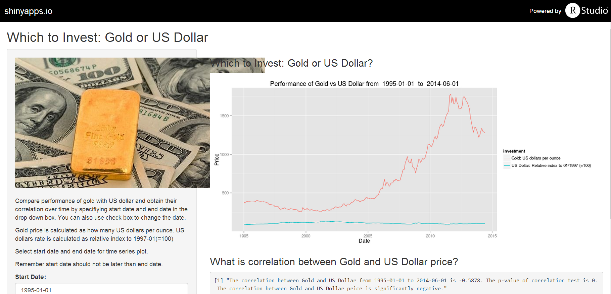

Which to Invest: Gold or US Dollars?
========================================================
author: Zhao Yunkun
date: 2015/07/24

Why This Project?
========================================================
Investors are often faced with one serious question: What should I invest? Most investors may choose gold or US dollars to preserve their asset value since these two commodities are most stable in intrinsic value. In fact, there is insteresting relationship between these two commodities. In most cases, when many investors are confident about US dollars, they will sell gold for dollars so that gold spot price drops and US dollar rises in exchange rate. On the contrary, when investors are not confident about US dollars (e.g. US monetary policy, financial crisis, etc.), they will purchase gold using dollars, so that US dollar devalues and gold stop price appreciates. Roughly speaking, the relationship between gold price and US dollar rate is assumed to be negative in most time periods.

Why This Project?
========================================================
What are possible practical implications in this argument? Since both gold spot price and US dollar rate are serially correlated and have time lagged effect, you can actually use gold price to predict US dollar rate, or use US dollar rate to predict gold price. Simply speaking, if you see any suspicious evidence indicating depreciation in US dollar, just go and purchase gold commodity or gold futures.

Monthly time window is chossen from 1995-01-01 to 2014-06-01.

Data Source and Data Clean
========================================================
Data about gold spot price is found at [Gold Price](http://data.okfn.org/data/core/gold-prices).  
Data about US dollar rate is found at [US Dollars Rate](https://research.stlouisfed.org/fred2/series/DTWEXB/downloaddata).  
Download and process data in Rstudio.   
Show some embedded R codes:


```
      Price       Date                 investment
541 378.738 1995-01-01 Gold: US dollars per ounce
```

```
    Price       Date                                  investment
1 94.1663 1995-01-01 US Dollar: Relative index to 01/1997 (=100)
```

How to Use This Shiny App <golddollar>
========================================================
  
You can change the following using checkbox & dropdown box:  
* Start Date & End Date  
* Pitch: Enjoy Shiny App here:  [golddollar](https://ximenglate.shinyapps.io/golddollar)

