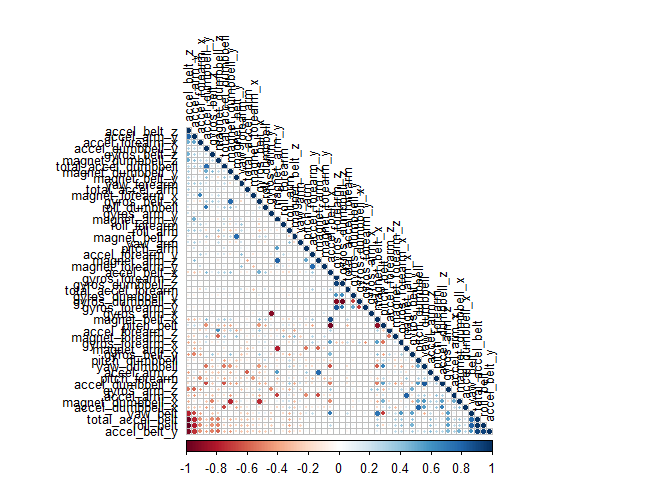
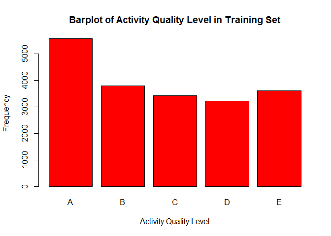
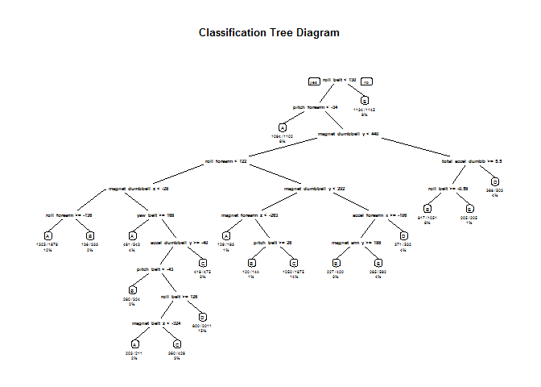

# Practical Machine Learning: Course Project
Zhao Yunkun  
Mon Jul 20 23:53:00 2015  

##0 Introduction
Using devices such as Jawbone Up, Nike FuelBand, and Fitbit it is now possible to collect a large amount of data about personal activity relatively inexpensively. These type of devices are part of the quantified self movement 鈥? a group of enthusiasts who take measurements about themselves regularly to improve their health, to find patterns in their behavior, or because they are tech geeks. One thing that people regularly do is quantify how much of a particular activity they do, but they rarely quantify how well they do it. In this project, your goal will be to use data from accelerometers on the belt, forearm, arm, and dumbell of 6 participants. They were asked to perform barbell lifts correctly and incorrectly in 5 different ways. More information is available from the website here: [http://groupware.les.inf.puc-rio.br/har](http://groupware.les.inf.puc-rio.br/har) (see the section on the Weight Lifting Exercise Dataset).

The goal of this project is to predict the manner in which they did the exercise. This is the "classe" variable in the training set. We may use any of the other variables to predict with. We should create a report describing how we built your model, how we used cross validation, what we think the expected out of sample error is, and why we made the choices you did. We will also use our prediction model to predict 20 different test cases. 

##1 Download and Load Data

```r
##setwd("C:/Users/User/Desktop/Practical Machine Learning/Course Project/")
library(ggplot2)
library(kernlab)
library(randomForest)
```

```
## randomForest 4.6-10
## Type rfNews() to see new features/changes/bug fixes.
```

```r
library(caret)
```

```
## Loading required package: lattice
```

```r
library(corrplot)
library(rpart)
library(rpart.plot)
library(rattle)
```

```
## Loading required package: RGtk2
## Rattle: A free graphical interface for data mining with R.
## XXXX 3.5.0 Copyright (c) 2006-2015 Togaware Pty Ltd.
## 键入'rattle()'去轻摇、晃动、翻滚你的数据。
```

```r
library(knitr)
opts_chunk$set(echo=TRUE)
```


```r
##Download and Load data into R
fileUrl1 <- "http://d396qusza40orc.cloudfront.net/predmachlearn/pml-training.csv"
fileUrl2 <- "http://d396qusza40orc.cloudfront.net/predmachlearn/pml-testing.csv"
download.file(fileUrl1, destfile="./pml-training.csv")
download.file(fileUrl2, destfile="./pml-testing.csv")
timeDownload <- date()
pml_training <- read.csv("./pml-training.csv", na.strings=c("NA"," ",""))
pml_testing <- read.csv("./pml-testing.csv", na.strings=c("NA"," ",""))
```
These two dataset files are downloaded on Tue Jul 21 17:26:44 2015.

##2 Data Clean

```r
##Subset by dropping null variables and unrelated variables
##First, drop null variables
id <- c()
for (j in 1:dim(pml_training)[2]) { ##by column
  for (i in 1:dim(pml_training)[1]) { ##by row
    if (is.na(pml_training[i,j])) {
      id <- c(id,j)
      break
    }
  }
}

##Second, drop unrelated variables
id <- c(id, 1:7)

##Then get clean training dataset
pml_training_clean <- pml_training[, -id]

##Similarly clean test dataset
id <- c()
for (j in 1:dim(pml_testing)[2]) { ##by column
  for (i in 1:dim(pml_testing)[1]) { ##by row
    if (is.na(pml_testing[i,j])) {
      id <- c(id,j)
      break
    }
  }
}
id <- c(id, 1:7)
pml_testing_clean <- pml_testing[, -id]
```


```r
##Train training dataset and cross-validate
##70% for training and 30% for cross-validate
inTrain <- createDataPartition(y=pml_training_clean$classe, p=0.7, list=FALSE)
train <- pml_training_clean[inTrain, ]
validate <- pml_training_clean[-inTrain, ]
```
We split the original training data into two part: 70% and 30%. The first 70% part is used for training the model. The second 30% part is used for cross-validation to ensure prediction accuracy. In this project, we choose random forest method. 

##3 Train Model and Cross Validate
###3.0 Why Choosing Random Forest
In this project, we choose random forest algorithm which can be very accurate and can balance out-of-sample error with built-in cross-validation component giving unbiased estimates. Other reasons for using random forest method include that, it can handle many variables at one trial, such as over 50 predictors in this project. Random forest method is usually one of the two top performing algorithms along with boosting in prediction contests.

###3.1 Train Model

```r
##Train model using random forest method and cross-validate: activity quality
modelFit <- randomForest(classe~., data=train) ##Train model
modelValidate <- predict(modelFit, validate) ##Cross-validate model
```

###3.2 Cross Validation

```r
cmatrix <- confusionMatrix(validate$classe, modelValidate) ##Check accuracy
cmatrix
```

```
## Confusion Matrix and Statistics
## 
##           Reference
## Prediction    A    B    C    D    E
##          A 1673    1    0    0    0
##          B    5 1132    2    0    0
##          C    0   15 1009    2    0
##          D    0    0   16  948    0
##          E    0    0    0    0 1082
## 
## Overall Statistics
##                                          
##                Accuracy : 0.993          
##                  95% CI : (0.9906, 0.995)
##     No Information Rate : 0.2851         
##     P-Value [Acc > NIR] : < 2.2e-16      
##                                          
##                   Kappa : 0.9912         
##  Mcnemar's Test P-Value : NA             
## 
## Statistics by Class:
## 
##                      Class: A Class: B Class: C Class: D Class: E
## Sensitivity            0.9970   0.9861   0.9825   0.9979   1.0000
## Specificity            0.9998   0.9985   0.9965   0.9968   1.0000
## Pos Pred Value         0.9994   0.9939   0.9834   0.9834   1.0000
## Neg Pred Value         0.9988   0.9966   0.9963   0.9996   1.0000
## Prevalence             0.2851   0.1951   0.1745   0.1614   0.1839
## Detection Rate         0.2843   0.1924   0.1715   0.1611   0.1839
## Detection Prevalence   0.2845   0.1935   0.1743   0.1638   0.1839
## Balanced Accuracy      0.9984   0.9923   0.9895   0.9973   1.0000
```

```r
accuracy <- cmatrix$overall[1] ##Accuracy is not low, so this model can be used
```
Model accuracy is 0.9930331 which is higher than 90%, so this model might be used in prediction.

###3.3 Out-of-sample Error
First, We need to check correlation table of variables since correlation between trees can increase out-of-sample error rate.

```r
corr <- cor(pml_training_clean[, -length(pml_training_clean)]) ##Correlation plot
corrplot(corr, order = "FPC", method = "circle",
         type = "lower", tl.cex = 0.8,  tl.col = rgb(0, 0, 0))
```

 

It is obvious that nearly none of two variables is highly correlated.


```r
##Expect the out-of-sample error and estimate error with cross-validation
ExpectOOSER <- 1-accuracy ##Expected out-of-sample error rate
validate$predRight <- modelValidate==validate$classe
table(modelValidate, validate$classe) ##Validation table
```

```
##              
## modelValidate    A    B    C    D    E
##             A 1673    5    0    0    0
##             B    1 1132   15    0    0
##             C    0    2 1009   16    0
##             D    0    0    2  948    0
##             E    0    0    0    0 1082
```

```r
misclassification <- 1-sum(validate$predRight)/length(validate$classe) ##Actual misclassification rate
misclassification
```

```
## [1] 0.006966865
```
The expected miscalssification rate or out-of-sample error rate is 0.0069669. The actual misclassification rate or out-of-sample error rate is 0.0069669. In addition, accuracy rate is 0.9930331. These indicate that out-of-sample error rate may not be high and accuracy is high enough. So we can use this model to conduct prediction.

###3.4 Exploratory Plots

```r
plot(pml_training_clean$classe, col="red", main="Barplot of Activity Quality Level in Training Set",
     xlab="Activity Quality Level", ylab="Frequency")
```

 

```r
modelFitTree <- rpart(classe~., data=train, method="class") ##Decision tree plot
rpart.plot(modelFitTree, main="Classification Tree Diagram", extra=102, under=TRUE, faclen=0)
```

 

##4 Prediction in Testing Set: Activity Quality
Now we have 20 cases in testing set to predict. The prediction results are stored for later submission.

```r
##Predict testing dataset: activity quality
testPredict <- predict(modelFit, pml_testing_clean)
testPredict ##Prediction results
```

```
##  1  2  3  4  5  6  7  8  9 10 11 12 13 14 15 16 17 18 19 20 
##  B  A  B  A  A  E  D  B  A  A  B  C  B  A  E  E  A  B  B  B 
## Levels: A B C D E
```

##5 Save Files to Submit

```r
answers <- as.character(testPredict) ##20 Answers
pml_write_files = function(x){
  n = length(x)
  for(i in 1:n){
    filename = paste0("problem_id_",i,".txt")
    write.table(x[i],file=filename,quote=FALSE,row.names=FALSE,col.names=FALSE)
  }
}
pml_write_files(answers)
```

##6 References
Velloso, E.; Bulling, A.; Gellersen, H.; Ugulino, W.; Fuks, H. [**Qualitative Activity Recognition of Weight Lifting Exercises**](http://groupware.les.inf.puc-rio.br/work.jsf?p1=11201). Proceedings of 4th International Conference in Cooperation with SIGCHI (Augmented Human '13) . Stuttgart, Germany: ACM SIGCHI, 2013.
