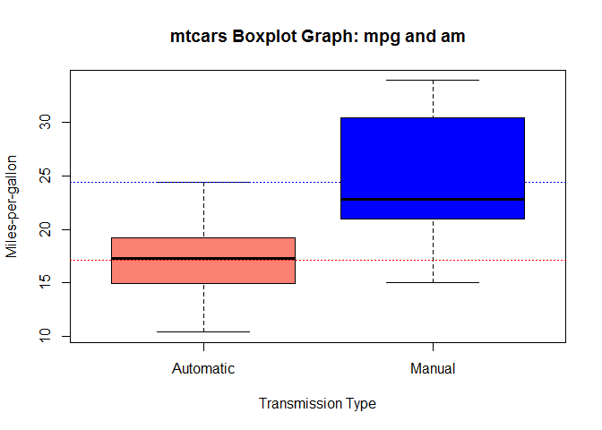

# The Effect of Transmission Type on Automobile Miles-per-Gallon
YK Zhao  
Saturday, June 20, 2015  

##0 Introduction and Executive Summary
In this project, assume you work for Motor Trend, a magazine about the automobile industry. Looking at a data set of a collection of cars, they are interested in exploring the relationship between a set of variables and miles-per-gallon (mpg). They are particularly interested in the following two questions. First, is an automatic or manual transmission better for MPG? Second, quantify the MPG difference between automatic and manual transmissions.  

This project is purported to answer these two questions. After exploratory data analysis and further several regression model fits, basic results show that miles-per-gallon is higher for manual type than automatic type.

##1 Set Environment

```r
##Set environment
library(knitr)
library(datasets)
library(ggplot2)
library(plyr)
opts_chunk$set(echo=TRUE)
```

##2 Exploratory Data Analysis

```r
##Load data and preprocess
data(mtcars)
head(mtcars)
```

```
##                    mpg cyl disp  hp drat    wt  qsec vs am gear carb
## Mazda RX4         21.0   6  160 110 3.90 2.620 16.46  0  1    4    4
## Mazda RX4 Wag     21.0   6  160 110 3.90 2.875 17.02  0  1    4    4
## Datsun 710        22.8   4  108  93 3.85 2.320 18.61  1  1    4    1
## Hornet 4 Drive    21.4   6  258 110 3.08 3.215 19.44  1  0    3    1
## Hornet Sportabout 18.7   8  360 175 3.15 3.440 17.02  0  0    3    2
## Valiant           18.1   6  225 105 2.76 3.460 20.22  1  0    3    1
```

```r
##Summarize dataset
str(mtcars)
```

```
## 'data.frame':	32 obs. of  11 variables:
##  $ mpg : num  21 21 22.8 21.4 18.7 18.1 14.3 24.4 22.8 19.2 ...
##  $ cyl : num  6 6 4 6 8 6 8 4 4 6 ...
##  $ disp: num  160 160 108 258 360 ...
##  $ hp  : num  110 110 93 110 175 105 245 62 95 123 ...
##  $ drat: num  3.9 3.9 3.85 3.08 3.15 2.76 3.21 3.69 3.92 3.92 ...
##  $ wt  : num  2.62 2.88 2.32 3.21 3.44 ...
##  $ qsec: num  16.5 17 18.6 19.4 17 ...
##  $ vs  : num  0 0 1 1 0 1 0 1 1 1 ...
##  $ am  : num  1 1 1 0 0 0 0 0 0 0 ...
##  $ gear: num  4 4 4 3 3 3 3 4 4 4 ...
##  $ carb: num  4 4 1 1 2 1 4 2 2 4 ...
```

```r
summary(mtcars)
```

```
##       mpg             cyl             disp             hp       
##  Min.   :10.40   Min.   :4.000   Min.   : 71.1   Min.   : 52.0  
##  1st Qu.:15.43   1st Qu.:4.000   1st Qu.:120.8   1st Qu.: 96.5  
##  Median :19.20   Median :6.000   Median :196.3   Median :123.0  
##  Mean   :20.09   Mean   :6.188   Mean   :230.7   Mean   :146.7  
##  3rd Qu.:22.80   3rd Qu.:8.000   3rd Qu.:326.0   3rd Qu.:180.0  
##  Max.   :33.90   Max.   :8.000   Max.   :472.0   Max.   :335.0  
##       drat             wt             qsec             vs        
##  Min.   :2.760   Min.   :1.513   Min.   :14.50   Min.   :0.0000  
##  1st Qu.:3.080   1st Qu.:2.581   1st Qu.:16.89   1st Qu.:0.0000  
##  Median :3.695   Median :3.325   Median :17.71   Median :0.0000  
##  Mean   :3.597   Mean   :3.217   Mean   :17.85   Mean   :0.4375  
##  3rd Qu.:3.920   3rd Qu.:3.610   3rd Qu.:18.90   3rd Qu.:1.0000  
##  Max.   :4.930   Max.   :5.424   Max.   :22.90   Max.   :1.0000  
##        am              gear            carb      
##  Min.   :0.0000   Min.   :3.000   Min.   :1.000  
##  1st Qu.:0.0000   1st Qu.:3.000   1st Qu.:2.000  
##  Median :0.0000   Median :4.000   Median :2.000  
##  Mean   :0.4062   Mean   :3.688   Mean   :2.812  
##  3rd Qu.:1.0000   3rd Qu.:4.000   3rd Qu.:4.000  
##  Max.   :1.0000   Max.   :5.000   Max.   :8.000
```

```r
##Exploratory data analysis
##pairwise graphs
pair <- pairs(mtcars, panel=panel.smooth, main="mtcars Pairwise Graphs")
```

 

```r
##boxplot of miles-per-gallon with transmission type
bp <- boxplot(mpg~am, data=mtcars, 
              xlab="Transmission Type", ylab="Miles-per-gallon",
              main="mtcars Boxplot Graph: mpg and am",
              col=c("salmon","blue"), names=c("Automatic","Manual"))

##Mean of miles-per-gallon with transmission type
autoMean <- mean(mtcars[which(mtcars$am==0),"mpg"])
manualMean <- mean(mtcars[which(mtcars$am==1),"mpg"])
abline(h=autoMean, col="red", lty=3)
abline(h=manualMean, col="blue", lty=3)
```

 

```r
##Difference between transmission type
diff <- manualMean - autoMean

##Correlation table of all variables
cor(mtcars)
```

```
##             mpg        cyl       disp         hp        drat         wt
## mpg   1.0000000 -0.8521620 -0.8475514 -0.7761684  0.68117191 -0.8676594
## cyl  -0.8521620  1.0000000  0.9020329  0.8324475 -0.69993811  0.7824958
## disp -0.8475514  0.9020329  1.0000000  0.7909486 -0.71021393  0.8879799
## hp   -0.7761684  0.8324475  0.7909486  1.0000000 -0.44875912  0.6587479
## drat  0.6811719 -0.6999381 -0.7102139 -0.4487591  1.00000000 -0.7124406
## wt   -0.8676594  0.7824958  0.8879799  0.6587479 -0.71244065  1.0000000
## qsec  0.4186840 -0.5912421 -0.4336979 -0.7082234  0.09120476 -0.1747159
## vs    0.6640389 -0.8108118 -0.7104159 -0.7230967  0.44027846 -0.5549157
## am    0.5998324 -0.5226070 -0.5912270 -0.2432043  0.71271113 -0.6924953
## gear  0.4802848 -0.4926866 -0.5555692 -0.1257043  0.69961013 -0.5832870
## carb -0.5509251  0.5269883  0.3949769  0.7498125 -0.09078980  0.4276059
##             qsec         vs          am       gear        carb
## mpg   0.41868403  0.6640389  0.59983243  0.4802848 -0.55092507
## cyl  -0.59124207 -0.8108118 -0.52260705 -0.4926866  0.52698829
## disp -0.43369788 -0.7104159 -0.59122704 -0.5555692  0.39497686
## hp   -0.70822339 -0.7230967 -0.24320426 -0.1257043  0.74981247
## drat  0.09120476  0.4402785  0.71271113  0.6996101 -0.09078980
## wt   -0.17471588 -0.5549157 -0.69249526 -0.5832870  0.42760594
## qsec  1.00000000  0.7445354 -0.22986086 -0.2126822 -0.65624923
## vs    0.74453544  1.0000000  0.16834512  0.2060233 -0.56960714
## am   -0.22986086  0.1683451  1.00000000  0.7940588  0.05753435
## gear -0.21268223  0.2060233  0.79405876  1.0000000  0.27407284
## carb -0.65624923 -0.5696071  0.05753435  0.2740728  1.00000000
```
The pairwise graph is shown to exhibit the overall linear relationships between mpg and other explanatory variables. A correlation tables is also presented to show the correlation coefficient of each two variables to facilitate stepwise regression and model selection in the next section.

The boxplot graph is shown to exhibit roughly mean difference in mpg between automatic (17.1473684) and manual transmission type (24.3923077). From this boxplot graph, it is obvious that there is difference in mean mpg of different transmission types, that is, mpg of manual type is higher than that of automatic type.

##3 Model and Results
Next we will fit the OLS model using full set of variables and then stepwise to fit multiple models and do model selection (P-value and R-square).

```r
##First we should factorize some categorical variables
mtcars$cyl <- factor(mtcars$cyl)
mtcars$vs <- factor(mtcars$vs)
mtcars$am <- factor(mtcars$am, labels = c("automatic", "manual"))
mtcars$gear <- factor(mtcars$gear)
mtcars$carb <- factor(mtcars$carb)

##Then we include full set of variables to do OLS regression
full <- lm(mpg ~ ., data=mtcars)

##Next we stepwise OLS regression, fit multiple models and do model selection
base <- lm(mpg ~ am, data=mtcars); summary(base)
```

```
## 
## Call:
## lm(formula = mpg ~ am, data = mtcars)
## 
## Residuals:
##     Min      1Q  Median      3Q     Max 
## -9.3923 -3.0923 -0.2974  3.2439  9.5077 
## 
## Coefficients:
##             Estimate Std. Error t value Pr(>|t|)    
## (Intercept)   17.147      1.125  15.247 1.13e-15 ***
## ammanual       7.245      1.764   4.106 0.000285 ***
## ---
## Signif. codes:  0 '***' 0.001 '**' 0.01 '*' 0.05 '.' 0.1 ' ' 1
## 
## Residual standard error: 4.902 on 30 degrees of freedom
## Multiple R-squared:  0.3598,	Adjusted R-squared:  0.3385 
## F-statistic: 16.86 on 1 and 30 DF,  p-value: 0.000285
```

```r
step <- step(lm(mpg ~ ., data=mtcars), trace=0); summary(step)
```

```
## 
## Call:
## lm(formula = mpg ~ cyl + hp + wt + am, data = mtcars)
## 
## Residuals:
##     Min      1Q  Median      3Q     Max 
## -3.9387 -1.2560 -0.4013  1.1253  5.0513 
## 
## Coefficients:
##             Estimate Std. Error t value Pr(>|t|)    
## (Intercept) 33.70832    2.60489  12.940 7.73e-13 ***
## cyl6        -3.03134    1.40728  -2.154  0.04068 *  
## cyl8        -2.16368    2.28425  -0.947  0.35225    
## hp          -0.03211    0.01369  -2.345  0.02693 *  
## wt          -2.49683    0.88559  -2.819  0.00908 ** 
## ammanual     1.80921    1.39630   1.296  0.20646    
## ---
## Signif. codes:  0 '***' 0.001 '**' 0.01 '*' 0.05 '.' 0.1 ' ' 1
## 
## Residual standard error: 2.41 on 26 degrees of freedom
## Multiple R-squared:  0.8659,	Adjusted R-squared:  0.8401 
## F-statistic: 33.57 on 5 and 26 DF,  p-value: 1.506e-10
```

```r
compare <- anova(base, step)
```
The coefficient of transmission type am is 7.2449393 and is significant with T-value below 0.05. The simple interpretation of this coefficient is, mean mpg of manual type is roughly 7.245 units higher than mean mpg of automatic type. However, we need to further check this relation adding other covariates to ensure robustness.  

The correlation table and pairwise graph presented in the previous section can roughly tell you potential variables that should be included, judging by correlation between each two explanatory variables not too high (i.e. avoid multicollinearty) and linear type of relationship between dependent variable mpg with each explanatory variable (i.e. ensure linearity). Now from stepwise regression we can tell difference in results given by different model specification from P-value and R-square. From comparisons, we can see R-square is significantly increased after adding covariates (86% vs 36%), and P-value is below 0.05 which means new model is different from base model. 

As you can see, after adding other covariates, relationship between mpg and am is mitigated. Although the coefficient of am is not significant checking from T-value, the coefficient is still positive meaning that mean mpg of manual type is higher than that of automatic type.

##4 Diagnostics and Inferences

```r
##Diagnotics of residual plots
par(mfrow=c(2,2))
plot(step)
```

 

From residual plot, it is obvious that there is no clear pattern between fitted values and residuals, so we can preclude heteroscedasticity problem here. From Q-Q plot, we can see that plots are not significantly diverged from normal distribution quantile, so we can ensure that residuals or model errors are normally distributed. Scale-location plot and residuals vs leverage plot can tell you that there is no severe influential point or outlier problem in this regression. Therefore, after we ensuring linearity, randomness and normality of error term, avoidance of heteroscedasticity, endogeneity and multicollinearity problem, we can make sure that this OLS regression satisfies Gaussian-Markov assumptions. 


```r
##Two sample T-test between two transmission types
ttest <- t.test(mpg~am, data=mtcars); ttest
```

```
## 
## 	Welch Two Sample t-test
## 
## data:  mpg by am
## t = -3.7671, df = 18.332, p-value = 0.001374
## alternative hypothesis: true difference in means is not equal to 0
## 95 percent confidence interval:
##  -11.280194  -3.209684
## sample estimates:
## mean in group automatic    mean in group manual 
##                17.14737                24.39231
```
We should conduct two sample T-test to see whether there is significant difference with two transmission types. T-value is negative and P-value is below 0.05, so mean mpg of automatic type is significantly lower than that of manual type.

##5 Conclusions
In conclusion, there is mean difference in miles-per-gallon (mpg) between two different transmission types. On average, manual type leads to higher mpg than automatic type does.
