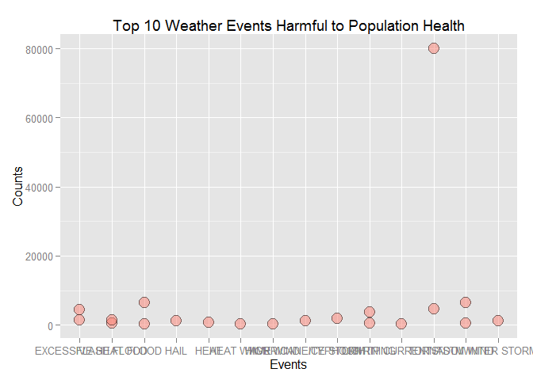
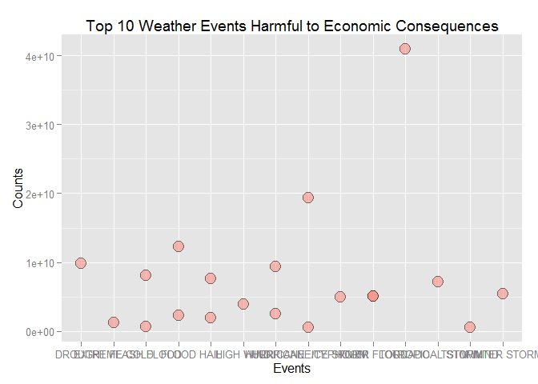

# The Effect of Weather Events on Population Health and Economic Consequences
YK Zhao  
Saturday, June 20, 2015  
##0 Title: The Effect of Weather Events on Population Health and Economic Consequences

##1 Synopsis
The basic goal of this project is to explore the NOAA Storm Database and answer some basic questions about severe weather events. Questions are (1) Across the United States, which types of events (as indicated in the EVTYPE variable) are most harmful with respect to population health? and (2) Across the United States, which types of events have the greatest economic consequences?

Results from data and figures show that "Tornado" leads to highest fatality counts and "Tornado" leads to highest injury counts. "Tornado" causes most severe property damage and "Drought" causes most severe crop damage.

##2 Set Environment

```r
##Set environment
##setwd("C:/Users/User/Desktop/Reproducible research/Peer assessment 2/") 
library(knitr)
library(ggplot2)
library(plyr)
opts_chunk$set(echo=TRUE)
```

##3 Data Processing
##First you should download data, unzip data and load data into R

```r
##Download zip file
fileUrl <- "http://d396qusza40orc.cloudfront.net/repdata%2Fdata%2FStormData.csv.bz2"
download.file(fileUrl, destfile = "./repdata-data-StormData.csv.bz2")
timeDownload <- date()

##Load csv file after unzipping
##unzip("./repdata-data-StormData.zip")
storm <- read.csv("./repdata-data-StormData.csv", header=TRUE)
```

```
## Warning in scan(file, what, nmax, sep, dec, quote, skip, nlines,
## na.strings, : EOF within quoted string
```

```r
##head(storm, 10)
```
Time for downloading zip file is Sat Jun 20 22:22:46 2015.

##Then you should do some data processing
##Since the dataset is too large, it is necessary to select only those we need for this project

```r
select <- c("EVTYPE","FATALITIES","INJURIES","PROPDMG", "PROPDMGEXP", "CROPDMG", "CROPDMGEXP") ##Variables we need
storm <- storm[1:547363, select] ##Rows we need
head(storm, 10)
```

```
##     EVTYPE FATALITIES INJURIES PROPDMG PROPDMGEXP CROPDMG CROPDMGEXP
## 1  TORNADO       0.00    15.00   25.00          K    0.00           
## 2  TORNADO       0.00     0.00    2.50          K    0.00           
## 3  TORNADO       0.00     2.00   25.00          K    0.00           
## 4  TORNADO       0.00     2.00    2.50          K    0.00           
## 5  TORNADO       0.00     2.00    2.50          K    0.00           
## 6  TORNADO       0.00     6.00    2.50          K    0.00           
## 7  TORNADO       0.00     1.00    2.50          K    0.00           
## 8  TORNADO       0.00     0.00    2.50          K    0.00           
## 9  TORNADO       1.00    14.00   25.00          K    0.00           
## 10 TORNADO       0.00     0.00   25.00          K    0.00
```

```r
str(storm)
```

```
## 'data.frame':	547363 obs. of  7 variables:
##  $ EVTYPE    : Factor w/ 32820 levels " over 10 bridges were underwater. Many roadways sustained damage from the flood waters. Rainfall totals reached 8.45 inches abo"| __truncated__,..: 32669 32669 32669 32669 32669 32669 32669 32669 32669 32669 ...
##  $ FATALITIES: Factor w/ 19697 levels ""," -2.18 feet below mean lower low water at Atlantic City (Atlantic County)",..: 19282 19282 19282 19282 19282 19282 19282 19282 19546 19282 ...
##  $ INJURIES  : Factor w/ 19446 levels ""," -2.29 feet below mean lower low water in Absecon (Atlantic County) and -1.80 feet below mean lower low water at the Cape May F"| __truncated__,..: 19199 18909 19229 19229 19229 19368 19158 18909 19193 18909 ...
##  $ PROPDMG   : Factor w/ 19848 levels "","-88.30533",..: 19216 19130 19216 19130 19130 19130 19130 19130 19216 19216 ...
##  $ PROPDMGEXP: Factor w/ 18583 levels "","-"," -2.27 feet below mean lower low water at Barnegat Light (Ocean County)",..: 18578 18578 18578 18578 18578 18578 18578 18578 18578 18578 ...
##  $ CROPDMG   : Factor w/ 18622 levels "","-87.86591",..: 17967 17967 17967 17967 17967 17967 17967 17967 17967 17967 ...
##  $ CROPDMGEXP: Factor w/ 17988 levels ""," -10 to -30 C. layer",..: 1 1 1 1 1 1 1 1 1 1 ...
```

```r
summary(storm)
```

```
##                 EVTYPE         FATALITIES        INJURIES     
##  TSTM WIND         :189928   0.00   :542593   0.00   :533330  
##  HAIL              :180954   1.00   :  3308   1.00   :  5869  
##  TORNADO           : 49289   2.00   :   703   2.00   :  2511  
##  FLASH FLOOD       : 27451   3.00   :   246   3.00   :  1296  
##  THUNDERSTORM WINDS: 20843   4.00   :   123   4.00   :   774  
##  LIGHTNING         :  9953   5.00   :    94   5.00   :   586  
##  (Other)           : 68945   (Other):   296   (Other):  2997  
##     PROPDMG         PROPDMGEXP        CROPDMG         CROPDMGEXP    
##  0.00   :410406          :395130   0.00   :533162          :525930  
##  5.00   : 19516   K      :144484   5.00   :  2970   K      : 20189  
##  25.00  : 12900   M      :  7402   50.00  :  1355   M      :  1190  
##  10.00  : 11041   0      :   215   10.00  :  1348   k      :    21  
##  50.00  :  8939   5      :    28   2.00   :   802   0      :    19  
##  2.00   :  8606   1      :    25   1.00   :   733   ?      :     7  
##  (Other): 75955   (Other):    79   (Other):  6993   (Other):     7
```

##Population health

```r
##Get fatality and injury
fatality <- storm[1:547363, c("EVTYPE","FATALITIES")]
injury <- storm[1:547363, c("EVTYPE","INJURIES")]

##Aggregate sum them by event
fatality <- aggregate(as.numeric(as.character(fatality$FATALITIES)), by=list(fatality$EVTYPE), sum)
injury <- aggregate(as.numeric(as.character(injury$INJURIES)), by=list(injury$EVTYPE), sum)
names(fatality) <- c("event","fatalitycount")
names(injury) <- c("event","injurycount")
```

##Economic consequence
##In this dataset, economic consequence is measured by property damage and crop damage

```r
##Get property damage: Need transform with exponent unit
##K for thousands, M for millions, B for billions
propdmg <- storm[1:547363, c("EVTYPE","PROPDMG","PROPDMGEXP")]
propdmg$prop <- 0 ##Initialize
propdmg$PROPDMGEXP <- as.character(propdmg$PROPDMGEXP)
propdmg$PROPDMG <- as.numeric(as.character(propdmg$PROPDMG))

for (i in 1:nrow(propdmg)) { ##Transform with exponent unit
  if(toupper(propdmg[i,3]) == "K") {
    propdmg[i,4] <- propdmg[i,2]*10^3
  }else if(toupper(propdmg[i,3]) == "M") {
    propdmg[i,4] <- propdmg[i,2]*10^6
  }else if(toupper(propdmg[i,3]) == "B") {
    propdmg[i,4] <- propdmg[i,2]*10^9
  }else {
    propdmg[i,4] <- propdmg[i,2]
  }##End if
}##End for

##Get crop damage: Need transform with exponent unit
##K for thousands, M for millions, B for billions
cropdmg <- storm[1:547363, c("EVTYPE","CROPDMG","CROPDMGEXP")]
cropdmg$crop <- 0 ##Initialize
cropdmg$CROPDMGEXP <- as.character(cropdmg$CROPDMGEXP)
cropdmg$CROPDMG <- as.numeric(as.character(cropdmg$CROPDMG))

for (i in 1:nrow(cropdmg)) { ##Transform with exponent unit
  if(toupper(cropdmg[i,3]) == "K") {
    cropdmg[i,4] <- cropdmg[i,2]*10^3
  }else if(toupper(cropdmg[i,3]) == "M") {
    cropdmg[i,4] <- cropdmg[i,2]*10^6
  }else if(toupper(cropdmg[i,3]) == "B") {
    cropdmg[i,4] <- cropdmg[i,2]*10^9
  }else {
    cropdmg[i,4] <- cropdmg[i,2]
  }##End if
}##End for

##Aggregate sum them by event
propdmg <- aggregate(propdmg$prop, by=list(propdmg$EVTYPE), sum)
cropdmg <- aggregate(cropdmg$crop, by=list(cropdmg$EVTYPE), sum)
names(propdmg) <- c("event","propertydamage")
names(cropdmg) <- c("event","cropdamage")
```

##4 Results
##First get top 10 events for each measure (fatality, injury, property damage and crop damage)

```r
##Population health
fatality10 <- arrange(fatality, desc(fatalitycount))[1:10,]
injury10 <- arrange(injury, desc(injurycount))[1:10,]

##Economic consequences
propdmg10 <- arrange(propdmg, desc(propertydamage))[1:10,]
cropdmg10 <- arrange(cropdmg, desc(cropdamage))[1:10,]

##Question 1 Which event is most harmful with respect to population health?
fatality10[1,]
```

```
##     event fatalitycount
## 1 TORNADO          4658
```

```r
injury10[1,]
```

```
##     event injurycount
## 1 TORNADO       80084
```

```r
##Question 2 Which event is most harmful with respect to economic consequences?
propdmg10[1,]
```

```
##     event propertydamage
## 1 TORNADO    40977706589
```

```r
cropdmg10[1,]
```

```
##     event cropdamage
## 1 DROUGHT 9860245000
```

```r
##Reshape and append datasets to append in terms of population health and economic consequences
fatality10$factor <- "fatality count"
injury10$factor <- "injury count"
names(fatality10) <- c("event","count","factor")
names(injury10) <- c("event","count","factor")
PH <- rbind(fatality10, injury10)

propdmg10$factor <- "property damage"
cropdmg10$factor <- "crop damage"
names(propdmg10) <- c("event","amount","factor")
names(cropdmg10) <- c("event","amount","factor")
EC <- rbind(propdmg10, cropdmg10)

##Plot figure for population health and economic consequences
p1 <- ggplot(data=PH, aes(x=event, y=count, group=factor(factor)))
p1 + geom_point(size=5, pch=21, fill="salmon", alpha=0.5) + labs(title="Top 10 Weather Events Harmful to Population Health", y="Counts", x="Events", fill="Measure Type")
```

 

```r
p2 <- ggplot(data=EC, aes(x=event, y=amount, group=factor(factor)))
p2 + geom_point(size=5, pch=21, fill="salmon", alpha=0.5) + labs(title="Top 10 Weather Events Harmful to Economic Consequences", y="Counts", x="Events", fill="Measure Type")
```

 

It is obvious that in terms of population health, "Tornado" leads to highest fatality counts and "Tornado" leads to highest injury counts. In terms of economic consequences, "Tornado" causes most severe property damage and "Drought" causes most severe crop damage.
  
##5 Conclusions
Results from data and figures show that "Tornado" is most harmful weather events with respect to population health, and "Tornado" and "Drought" weather events have the greatest economic consequences.

