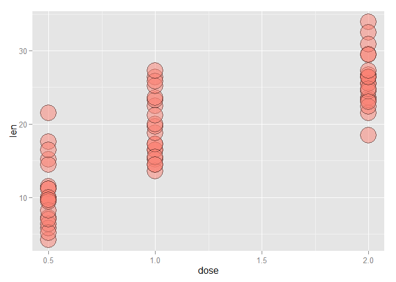
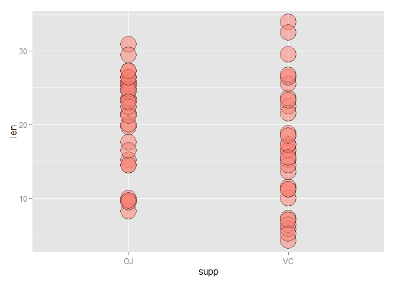
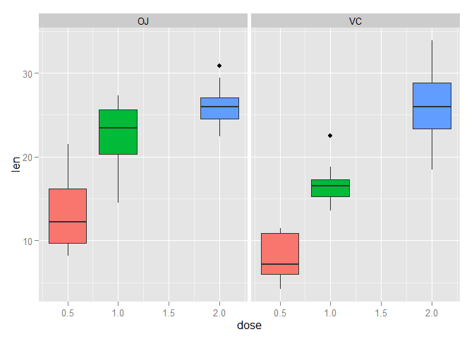
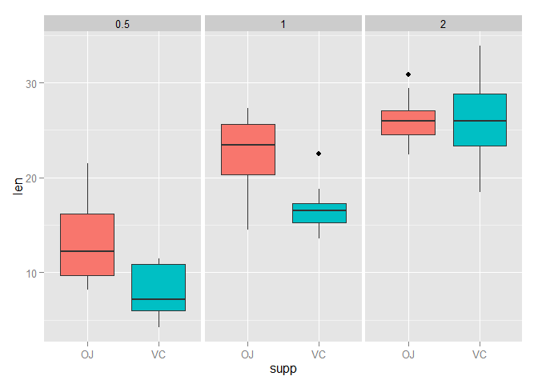

# Statistical Inference: Inference
by YK Zhao

##0 Introduction
In this project you will analyze the **ToothGrowth** data in the R datasets package. You are going to do following steps:    
1. Load the ToothGrowth data and perform some basic exploratory data analyses.  
2. Provide a basic summary of the data.    
3. Use confidence intervals and/or hypothesis tests to compare tooth growth by supp and dose. (Only use the techniques from class, even if there's other approaches worth considering).  
4. State your conclusions and the assumptions needed for your conclusions.     

Some criteria that you will be evaluated on:  
* Did you perform an exploratory data analysis of at least a single plot or table highlighting basic features of the data?  
* Did the student perform some relevant confidence intervals and/or tests?  
* Were the results of the tests and/or intervals interpreted in the context of the problem correctly?   
* Did the student describe the assumptions needed for their conclusions?  

##1 Loading and preprocessing the data

```r
##setwd("C:/Users/User/Desktop/Statistical Inference/")
library(knitr)
library(datasets)
library(ggplot2)
opts_chunk$set(echo=TRUE, eval=TRUE, fig.height=5)
```


```r
##ToothGrowth: The response is the length of odontoblasts (teeth) in each of 10 guinea   pigs at each of three dose levels of Vitamin C (0.5, 1, and 2 mg) with   each of two delivery methods (orange juice or ascorbic acid).
data(ToothGrowth)
head(ToothGrowth, 5)
```

```
##    len supp dose
## 1  4.2   VC  0.5
## 2 11.5   VC  0.5
## 3  7.3   VC  0.5
## 4  5.8   VC  0.5
## 5  6.4   VC  0.5
```

```r
##Preprocess dataset
dose <- ToothGrowth$dose
supp <- ToothGrowth$supp
len <- ToothGrowth$len ##tooth growth for comparison

##Split the data by dosages (0.5, 1, and 2 mg)
dose1 <- subset(ToothGrowth, dose==0.5)
dose2 <- subset(ToothGrowth, dose==1.0)
dose3 <- subset(ToothGrowth, dose==2.0)

##Split the data by supplement type (Vitamin C and Orange juice)
suppVC <- subset(ToothGrowth, supp=="VC")
suppOJ <- subset(ToothGrowth, supp=="OJ")
```

##2 Summarize dataset

```r
##len  numeric Tooth length
##supp factor  Supplement type (VC or OJ)
##dose numeric Dose in milligrams
summary(ToothGrowth)
```

```
##       len        supp         dose      
##  Min.   : 4.20   OJ:30   Min.   :0.500  
##  1st Qu.:13.07   VC:30   1st Qu.:0.500  
##  Median :19.25           Median :1.000  
##  Mean   :18.81           Mean   :1.167  
##  3rd Qu.:25.27           3rd Qu.:2.000  
##  Max.   :33.90           Max.   :2.000
```

##3 Exploratory data analysis

```r
##Relationship between dose and len
g1 <- ggplot(ToothGrowth, aes(x=dose, y=len, group=factor(supp)))
g1 <- g1 + geom_point(size=10, pch=21, fill="salmon", alpha=0.5)
g1
```

 

```r
##Relationship between supp and len
g2 <- ggplot(ToothGrowth, aes(x=supp, y=len, group=factor(dose)))
g2 <- g2 + geom_point(size=10, pch=21, fill="salmon", alpha=0.5)
g2
```

 

```r
##Use box plot to do exploratory analysis
b1 <- ggplot(ToothGrowth, aes(x =dose, y=len, fill=factor(dose))) 
b1 <- b1 + geom_boxplot() + guides(fill=FALSE) + facet_grid(.~supp)
b1
```

 

```r
b2 <- ggplot(ToothGrowth, aes(x=supp, y=len, fill=factor(supp))) 
b2 <- b2 + geom_boxplot() + guides(fill=FALSE) + facet_grid(.~dose)
b2
```

 

##4 Confidence intervals and hypothesis tests

```r
##T-test between supplement types
##Full sample (Paired, nonequal variance)
test0 <- t.test(len~supp, paired=TRUE, var.equal=TRUE, data=ToothGrowth)
test0$p.value
```

```
## [1] 0.002549842
```

```r
test0$conf[1:2]
```

```
## [1] 1.408659 5.991341
```

```r
##dose=0.5 (Independent, nonequal variance)
test1 <- t.test(len~supp, paired=FALSE, var.equal=FALSE, data=dose1)
test1$p.value
```

```
## [1] 0.006358607
```

```r
test1$conf[1:2]
```

```
## [1] 1.719057 8.780943
```

```r
##dose=1.0 (Independent, nonequal variance)
test2 <- t.test(len~supp, paired=FALSE, var.equal=FALSE, data=dose2)
test2$p.value
```

```
## [1] 0.001038376
```

```r
test2$conf[1:2]
```

```
## [1] 2.802148 9.057852
```

```r
##dose=2.0 (Independent, nonequal variance)
test3 <- t.test(len~supp, paired=FALSE, var.equal=FALSE, data=dose3)
test3$p.value
```

```
## [1] 0.9638516
```

```r
test3$conf[1:2]
```

```
## [1] -3.79807  3.63807
```

##5 Assumptions and Conclusions
The basic assumptions for this analysis is  
1. Treatment effect is not endogenous.  
2. There are no other alternative confounding factors.  
3. Samples are paired for supplement type, but with nonequal variance.  
From multiple T-test results, we are aware that in most cases, mean differences in tooth lengh between Vitamin C and Orange Juice supplement type is significant, which is indicated by both significant P-value (<0.05) and confidence intervals. The only exception is when dosage is high (i.e. 2.0mg) in which P-value is higher than 0.05 and confidence interval contains zero. Therefore, different supplement types will exert different mean effects on tooth growth. Basically, Orange Juice type will lead to longer tooth than Vitamin C type when dosage is 0.5mg and 1.0mg, but the mean effect is not significantly different when dosage is 2.0mg.
